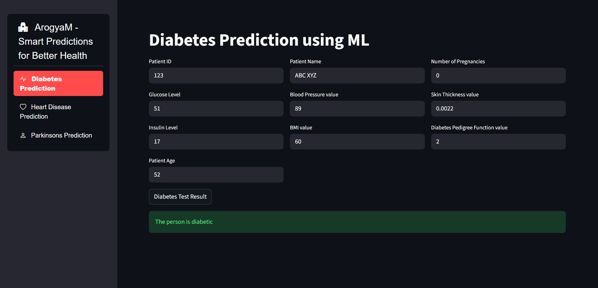
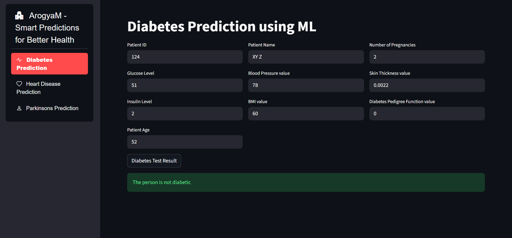
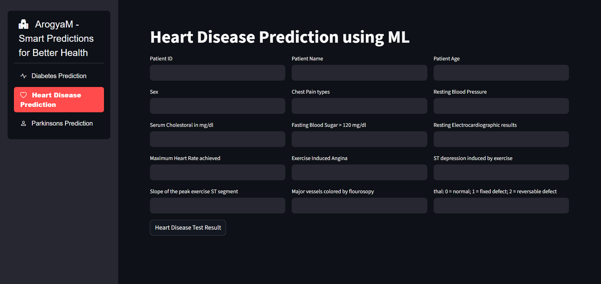
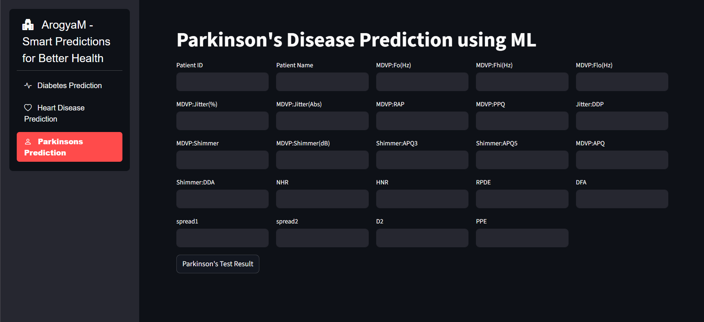

# Skills PBL – Machine Learning Prediction Web App

This project is a **Streamlit-based web application** that provides machine learning predictions for:

- Diabetes prediction
- Heart disease prediction
- Parkinsons prediction

The application allows users to input medical parameters and receive predictions from trained ML models.
This project aims to assist in early disease detection.

---------------------------------------------------------------------------------------------------------

## 🚀 Features

- Predicts multiple diseases in one platform
- Simple and user-friendly Streamlit UI
- Real-time prediction based on user inputs
- Uses trained ML models for accurate results
- Separate modules for each disease

---------------------------------------------------------------------------------------------------------

## 🧠 Machine Learning Models Used

The project uses multiple machine learning algorithms, and the best-performing models were selected based on evaluation metrics.

🩺 Diabetes Prediction
- Logistic Regression
- Support Vector Machine (SVM)

❤️ Heart Disease Prediction
- Random Forest Classifier
- Decision Tree Classifier

🧠 Parkinson’s Disease Prediction
- Support Vector Machine (SVM)

📊 Model Selection:
Models were compared using accuracy and performance metrics to choose the most optimal model.

---------------------------------------------------------------------------------------------------------
## 🧠 How It Works

- User enters medical parameters through the UI
- Input data is preprocessed
- Data is passed to trained ML models
- Model predicts disease likelihood
- Result is displayed instantly

---------------------------------------------------------------------------------------------------------

## 📸 Screenshots

### Diabetes

### Heart Disease

### Parkinsons Disease

